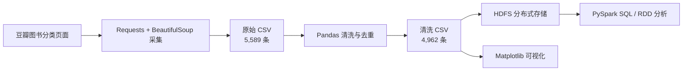
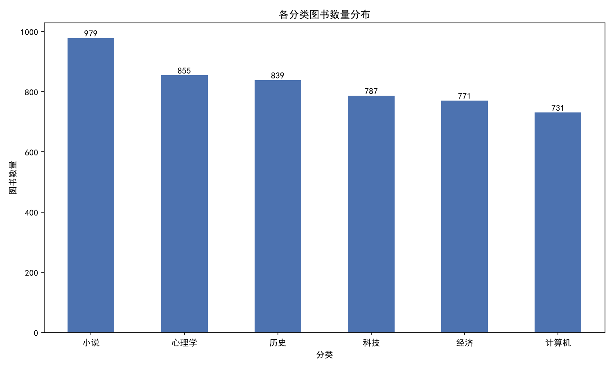
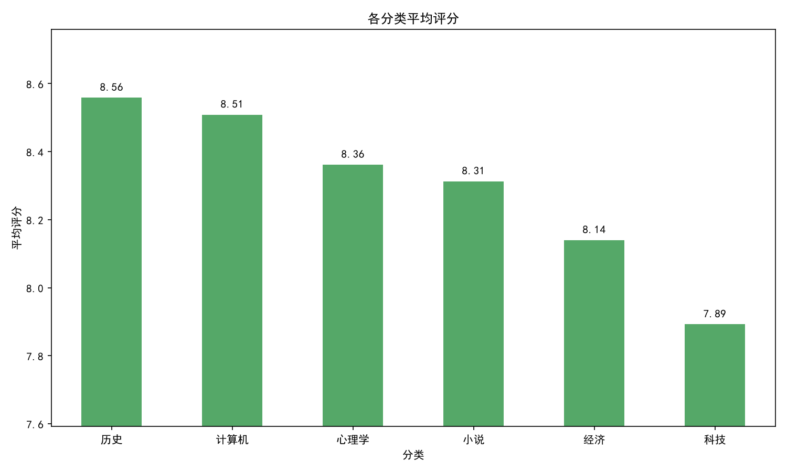
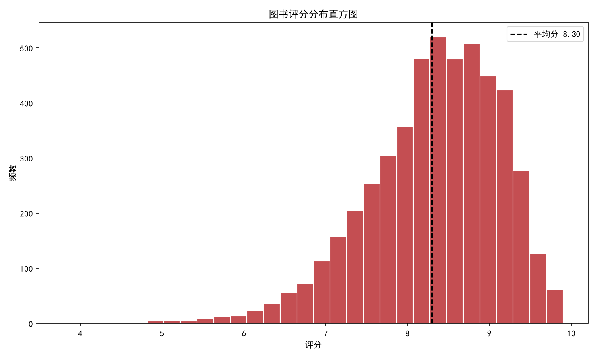
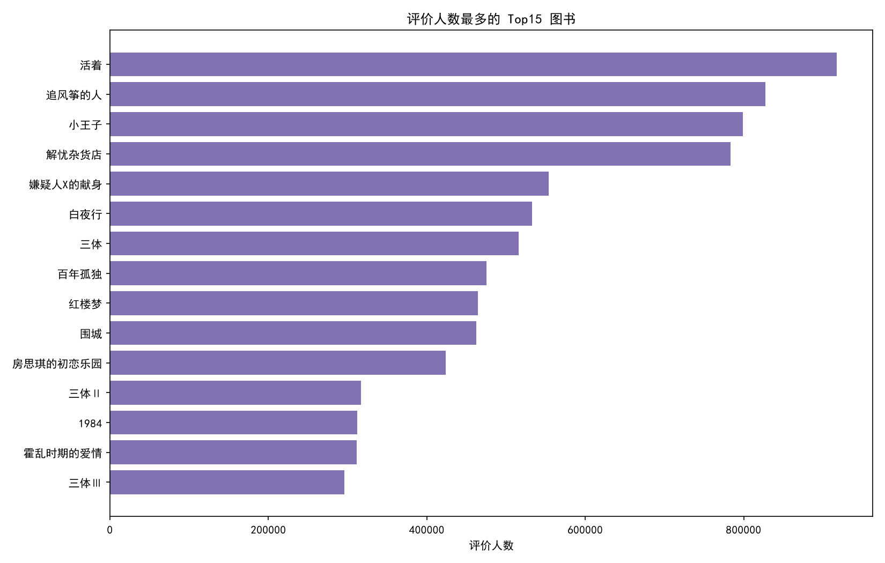

# 豆瓣图书大数据采集与分析

本项目是《大数据处理技术》课程项目，围绕豆瓣图书分类页面完成数据采集、清洗、HDFS 存储、PySpark 统计分析与 Matplotlib 可视化，覆盖大数据处理中的“采集—清洗—存储—计算—展示”完整流程。

项目报告：[2306106124_ 曾瑞-大数据处理技术报告2 .docx](<./2306106124_ 曾瑞-大数据处理技术报告2 .docx>)

## 项目概览

| 项目 | 内容 |
| --- | --- |
| 数据来源 | 豆瓣图书分类标签页 |
| 采集方式 | Python + Requests + BeautifulSoup |
| 原始数据量 | 5,589 条 |
| 清洗后数据量 | 4,962 条 |
| 数据分类数 | 6 类 |
| 分布式存储 | Hadoop HDFS |
| 分布式计算 | Apache Spark / PySpark SQL + RDD |
| 可视化 | Matplotlib |
| 作者 | 曾瑞 |

整体流程：



## 主要结果

- 原始数据采集量为 **5,589 条**，经去重、无效评分过滤、年份/价格转换及低评价人数过滤后，保留 **4,962 条**有效记录。
- 6 个分类的数据量为：小说 979、心理学 855、历史 839、科技 787、经济 771、计算机 731。
- 全部分类平均评分为 **8.30**，最高分类平均分为历史 **8.56**。
- 评价人数最多的图书为《活着》，共 **917,300** 人评价，评分为 **9.4**。

关键图表：

| 分类数量 | 分类平均评分 |
| --- | --- |
|  |  |

| 评分分布 | 热门图书 Top15 |
| --- | --- |
|  |  |

## 目录结构

```text
.
├── code/
│   ├── douban_spider_zengrui.py      # 豆瓣图书数据采集
│   ├── data_clean_zengrui.py         # 数据清洗与字段转换
│   ├── pyspark_analysis_zengrui.py   # HDFS + PySpark 统计分析
│   └── visualization_zengrui.py      # Matplotlib 图表生成
├── data/
│   ├── douban_books_raw_zengrui.csv
│   ├── douban_books_clean_zengrui.csv
│   └── figures_zengrui/              # 分析图表
├── requirements.txt
└── 2306106124_ 曾瑞-大数据处理技术报告2 .docx
```

## 数据字段

原始数据包含：分类、书名、作者、出版社、出版日期、价格、评分、评价人数和详情页 URL。

清洗后数据包含：分类、书名、作者、出版社、出版年份、价格、评分和评价人数。

主要清洗规则：

1. 按图书 URL 去重，URL 为空时按书名去重。
2. 将评分转换为数值，并过滤无评分或超出 0–10 的异常记录。
3. 从出版日期中提取四位年份，从价格文本中提取数值。
4. 过滤名称为空及评价人数少于 10 的低可信记录。

## 环境准备

本地采集、清洗和可视化建议使用 Python 3.9+：

```bash
python -m venv .venv

# Windows
.venv\Scripts\activate

# Linux / macOS
source .venv/bin/activate

pip install -r requirements.txt
```

完整 PySpark 流程还需要：

- JDK 8 或 11
- Hadoop 3.x（含 HDFS）
- Spark 3.x
- 已配置 `JAVA_HOME`、`HADOOP_HOME`、`SPARK_HOME`

## 运行流程

仓库已包含采集数据和结果图。若要重新执行完整流程：

### 1. 数据采集

```bash
python code/douban_spider_zengrui.py
```

脚本设置了随机等待、请求重试和 User-Agent 轮换。豆瓣页面结构或访问策略可能变化，重复采集时请遵守目标网站的服务条款和 robots 规则。

### 2. 数据清洗

```bash
python code/data_clean_zengrui.py
```

脚本读取 `data/douban_books_raw_zengrui.csv`，生成 `data/douban_books_clean_zengrui.csv`。

### 3. 上传到 HDFS

```bash
hdfs dfs -mkdir -p /user/hadoop/douban_zengrui
hdfs dfs -put -f data/douban_books_clean_zengrui.csv /user/hadoop/douban_zengrui/
hdfs dfs -ls /user/hadoop/douban_zengrui
```

### 4. PySpark 分析

先根据实际环境修改 `code/pyspark_analysis_zengrui.py` 中的 `HDFS_INPUT` 和 `LOCAL_OUT`，然后运行：

```bash
spark-submit code/pyspark_analysis_zengrui.py
```

分析内容包括分类数量、分类平均评分、评分区间、热门图书、高口碑图书、出版年份趋势和高产作者统计。

### 5. 生成可视化图表

```bash
python code/visualization_zengrui.py
```

图表输出到 `data/figures_zengrui/`。

## 说明

- 原始数据为项目执行期间采集的快照，已随仓库保存，便于复现实验。
- HDFS、Spark 路径需根据本机或集群环境调整。
- 本项目仅用于课程学习和数据分析实践。